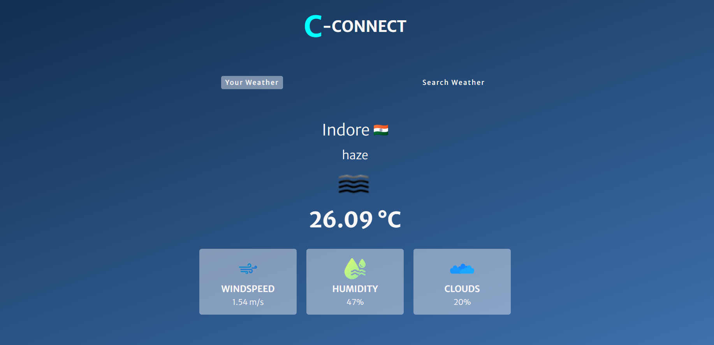

# Cloud Connect 🌤️

**Cloud Connect** is a web-based application that provides weather updates for your current location. Additionally, you can search for the weather report of any particular place worldwide. It's built using **HTML**, **CSS**, and **JavaScript**.

## Features 🚀

- 🌍 **Current Location Weather**: Automatically fetches and displays the weather for your current location.
- 🔍 **Search Weather by Location**: Allows users to search for weather details of any city or place.
- 🌡️ **Detailed Weather Report**: Includes temperature, humidity, wind speed, and weather conditions.
- 💡 **User-Friendly Interface**: Simple and intuitive design for a seamless user experience.
- 📱 **Responsive Design**: Works perfectly on desktops, tablets, and mobile devices.

## Technologies Used 🛠️

- **HTML**: For structuring the application.
- **CSS**: For styling and enhancing the UI/UX.
- **JavaScript**: For fetching and dynamically updating weather data.

## Browser Support🌐

- ✅ Chrome
- ✅ Firefox
- ✅ Safari
- ✅ Edge

## Contributing🤝

Contributions are welcome! Feel free to fork this repository and submit pull requests for:

- UI improvements
- Feature additions
- Bug fixes
- Performance optimizations

## License📜

This project is licensed under the MIT License. See [LICENSE](LICENSE) for details.
